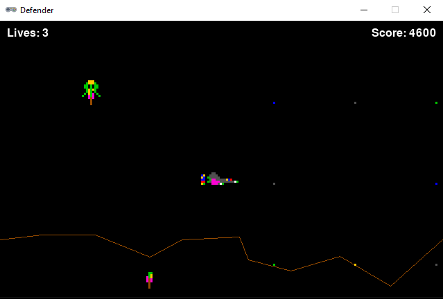

# DefenderClone

Simplified clone written in Python of the famous 1981 Williams game [Defender](https://en.wikipedia.org/wiki/Defender_(1981_video_game)).
Makes use of [pygame](https://github.com/pygame/pygame) and [pygame-zero](https://pygame-zero.readthedocs.io/en/stable/index.html#).
